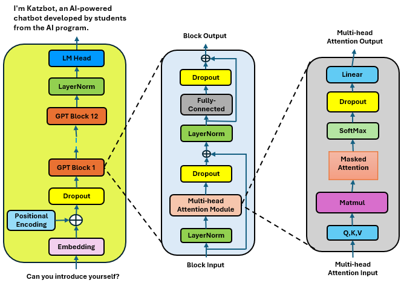

# KatzBot - Enhancing University Community Communication

## Table of Contents

- [Introduction](#introduction)
  - [Project Description](#project-description)
- [Dataset](#dataset)
  - [Pre Processing Data](#pre-processing-data)
  - [Sentence Completion Pairs](#sentence-completion-pairs)
  - [QA Pairs](#qa-pairs)
- [Method](#method)
  - [Data Preparation](#data-preparation)
  - [Tokenization](#tokenization)
  - [Model Architecture](#model-architecture)
  - [Dataset Initialization](#dataset-initialization)
- [Results](#results)
- [Citations](#citations)

## Introduction

Effective communication in university communities is crucial to cater to the diverse needs of stakeholders such as prospective and current students, alumni, and information seekers. However, existing academic chatbot systems often fall short of delivering precise communication, necessitating tailored solutions. In this study, we introduce KatzBot, a novel chatbot system powered by Katz Generative Pre-trained Transformer (KatzGPT), a custom Large Language Model (LLM). KatzBot aims to address the precision gaps observed in current chatbot systems deployed in academic institutions. To achieve this goal, we first collected all school's websites and then formed two comprehensive datasets comprising 6,280 sentence-completion pairs and 7,330 question-answer pairs. We train KatzGPT on the sentence-completion pairs to enrich its knowledge base and further fine-tune the model on the question-answer pairs to enhance its accuracy and efficacy in responding to user queries. Our experimental results demonstrate that KatzGPT outperforms state-of-the-art models when evaluated on our datasets, showcasing superior performance in terms of both knowledge enrichment and response accuracy. Moreover, we present KatzBot, an intuitive interface designed to facilitate seamless communication between users and the KatzGPT model, thereby enhancing user experience and satisfaction.

## Dataset

### Pre Processing Data

We preprocessed the data using regex and custom parsing techniques, standardizing sentences and tokenizing them. We removed duplicates and noise, organizing the dataset into sentence and question-answer pairs. Finally, we stored the data in CSV and JSON formats, ensuring compliance with privacy laws and creating a clean, structured dataset for chatbot development.

### Sentence Completion Pairs

We automated text segmentation into related sentence pairs, each column containing one sentence. Scripts were used to detect and remove nonsensical text and unwanted characters, followed by a manual review for accuracy. This effort yielded a dataset of over 6,400 related sentence pairs.

#### Sentence Completion Dataset Sample

| Sentence 1                                                      | Sentence 2                                                                                       |
|-----------------------------------------------------------------|--------------------------------------------------------------------------------------------------|
| The focus is on gaining a deeper understanding of the world to enable Judaism to address its challenges successfully | We are excited to introduce the distinguished members of the Sacks Research Scholars for the 2023-2024 academic year. |
| It is prohibited to work without first obtaining CPT authorization. | Please be patient during the processing time for OPT applications, as they cannot be expedited. |

### QA Pairs

We employed an automated script to process the text file, generating numerous question-and-answer pairs tailored for the chatbot. Additionally, we manually crafted additional pairs addressing common queries from new students. This effort resulted in a dataset of 7,334 question-and-answer pairs, enhancing quality and coverage.

#### QA Dataset Sample

| Question                                                                                    | Answer                                                                                                                                                                              |
|---------------------------------------------------------------------------------------------|-------------------------------------------------------------------------------------------------------------------------------------------------------------------------------------|
| What criteria are considered for successful Honors applicants?                              | Offers of admission are contingent on a student submitting an Intent to Enroll Form by the May 1st deadline. Enrollment in another university will be considered a forfeiture of Honors admission and scholarship. |
| What is the critical deadline students must meet to secure their admission and scholarship? | Offers of admission are contingent on a student submitting an Intent to Enroll Form by the May 1st deadline. Enrollment in another university will be considered a forfeiture of Honors admission and scholarship. |
| What are the average criteria for the current Honors cohort in terms of GPA, SAT, and ACT scores? | The current Honors cohort averages a GPA of 94, SAT score of 1460, and ACT score of 32.                                                                                              |

# Method

### Data Preparation

The dataset comprises question-answer pairs from academic contexts, such as university-related inquiries and responses. Each data item consists of a question and its corresponding answer.

### Tokenization

The data is tokenized using the AutoTokenizer from the Hugging Face Transformers library. The tokenizer encodes each question and answer text into token indices, ensuring compatibility with the model architecture.

### Dataset Initialization

The tokenized data is organized into a custom PyTorch Dataset subclass, named QADataset. This dataset prepares input-output pairs for training the CLM. Each data item includes input token IDs and corresponding label token IDs, representing the next token prediction task.

## Model Architecture

   

  The GPT-2 model features 12 Transformer decoder blocks. Each block includes a multi-head masked attention layer, a multi-layer perceptron layer, normalization, dropout layers, and utilizes residual connections to learn from the previous block's input. The multi-head masked attention layer captures sequential relationships in the input sequence using Q, K, and V vectors.

## Results

In our comparative analysis detailed in the table below, we assess the performance of several Large Language Models (LLMs), highlighting our in-house developed KatzGPT model. This evaluation benchmarks the Rouge Scores, focusing particularly on Rouge-L, which measures the long-form coherence of generated texts.

### Comparison of Rouge F-Scores for LLMs (sorted by Rouge L)

| Model                   | Rouge-1 | Rouge-2 | Rouge-L |
|-------------------------|---------|---------|---------|
| Llama2 3B               | 0.23    | 0.07    | 0.20    |
| Microsoft Phi 1.5       | 0.26    | 0.10    | 0.24    |
| Llama2 7B               | 0.28    | 0.12    | 0.25    |
| RAG                     | 0.26    | 0.12    | 0.24    |
| Microsoft Phi2          | 0.34    | 0.15    | 0.31    |
| Mistral 7B Instruct     | 0.43    | 0.20    | 0.33    |
| GPT-2                   | 0.45    | 0.32    | 0.43    |
| LlamaMOE                | 0.49    | 0.36    | 0.47    |
| **KatzGPT**             | **0.53**| **0.43**| **0.51**|

### LLMs Predictions Comparison

| User Input                                                          | Phi 2                                                                                                                     | Mistral 7B                                                                                                                                 | GPT-2                                                                                                         | LlamaMOE                                                                                                                            | KatzGPT                                                                                                                             |
|---------------------------------------------------------------------|---------------------------------------------------------------------------------------------------------------------------|--------------------------------------------------------------------------------------------------------------------------------------------|--------------------------------------------------------------------------------------------------------------|-------------------------------------------------------------------------------------------------------------------------------------|-------------------------------------------------------------------------------------------------------------------------------------|
| What career services does the university provide to its students?   | The university provides career services to help students find employment after graduation. These services include resume building, interview preparation, job search strategies, and networking opportunities. | The university provides career services that include personalized counseling, career planning, and access to professional networks.        | The university offers services to its student body.                                                        | The university provides career services to its students, including career counseling, resume writing, interview preparation, job search strategies, and access to job postings. These services are designed to help students explore career options, develop job search skills, and secure internships and full-time positions. | The university offers career services such as resume building workshops, interview preparation, job search assistance, and alumni networking opportunities to help students succeed in their professional endeavors. |
| Can you share information on internship opportunities for students? | Yes, KatzBot can provide information on internship opportunities for students. What department are you interested in?      | Yes, there are numerous internship opportunities available for students, both in the U.S. and in Israel, through the university Israel Center. | Internships are primarily during the summer, but you can also consider internships in New York, the financial capital of the world, or on an individual basis. | University provides students with access to internship opportunities through career fairs, networking events, and partnerships with industry leaders.                                 | University provides students with access to internship opportunities through career fairs, networking events, and partnerships with industry leaders.                                 |
| What are the basic admission requirements for this university for Data Analytics? | The basic admission requirements include a bachelor's degree from an accredited college or university, a minimum GPA of 3.0, and a minimum grade of Bplus in the prerequisite courses. | The basic admission requirements for this university for Data Analytics include a bachelor's degree with a strong mathematical and programming background. | The basic admission rules for this college program include a minimum GPA of 3.2, an SAT score of 1460 or an ACT score of 32, and approval from their high school administration. | The basic admission requirements for this university for Data Analytics are a high school diploma or equivalent, standardized test scores, and completion of prerequisite coursework in math and statistics. | The basic admission requirements for the Data Analytics program at University typically include a bachelor's degree in a related field, prerequisite coursework in statistics, computer science, or data analysis, letters of recommendation, a statement of purpose, and possibly standardized test scores like the GRE. |

## Citations

- Nur Syahirah Ahmad, Mohd Hamim Sanusi, Mohd Helmy Abd Wahab, Aida Mustapha, Zainal Abidin Sayadi, and Mohd Zainuri Saringat. "Conversational bot for pharmacy: a natural language approach." In 2018 IEEE conference on open systems (ICOS), pp. 76–79. IEEE, 2018.
- V. Arulmangainayaki, M. Harini, M. Keerthiga, and M. Deva Priya. "Intelligent chatbot for medical assistance in rural areas." International Journal of Innovative Technology and Exploring Engineering, 9, 2020.
- R. G. Athreya, A. C. Ngonga Ngomo, and R. Usbeck. "Enhancing community interactions with data-driven chatbots-the dbpedia chatbot." 2018.
- Ayah Atiyah, Shaidah Jusoh, and Firas Alghanim. Evaluation of the naturalness of chatbot applications,2019.
- Tom B. Brown, Benjamin Mann, Nick Ryder, Melanie Subbiah, Jared Kaplan, Prafulla Dhariwal, Arvind Neelakantan, Pranav Shyam, Girish Sastry, Amanda Askell, Sandhini Agarwal, Ariel Herbert-Voss, Gretchen Krueger, Tom Henighan, Rewon Child, Aditya Ramesh, Daniel M. Ziegler, Jeffrey Wu, Clemens Winter, Christopher Hesse, Mark Chen, Eric Sigler, Mateusz Litwin, Scott Gray, Benjamin Chess, Jack Clark, Christopher Berner, Sam McCandlish, Alec Radford, Ilya Sutskever, and Dario Amodei. Language models are few-shot learners, 2020b.
- Tim Dettmers, Artidoro Pagnoni, Ari Holtzman, and Luke Zettlemoyer. Qlora: Efficient finetuning of quantized llms, 2023.
- A. Jiao. An intelligent chatbot system based on entity extraction using rasa nlu and neural network.jphcs, 1487(1), 2020.

